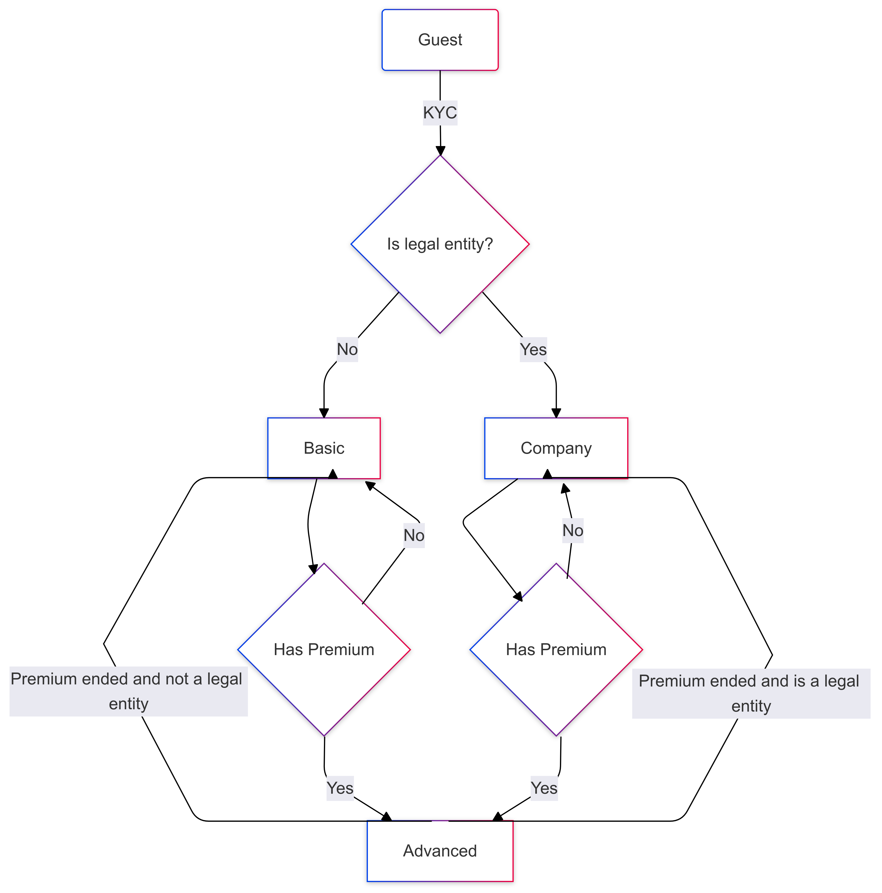

# Task 1

::: details Text of the assignment

**Задача 1**

Проанализировать предоставленные вводные данные и разработать документ, описывающий архитектуру системы, для внутреннего использования в любой форме по своему усмотрению. Объём текста не имеет значения.

**Ожидаемый результат**: текстовое описание, которые должно сопровождаться хотя бы одной диаграммой (приветствуется любая автогенерация, например, plantuml или mermaid) и таблицами по желанию.

**Язык**: английский.

**Вводные данные**:

Некая система реализует определённый набор сервисов для пользователей партнёров. Множества пользователей разных партнёров (провайдеров) не пересекаются. Партнёрам может быть доступна одна и та же функциональность, но набор функций и прав конфигурируется для каждого из них отдельно. Существует несколько типов конечных пользователей: “basic”, “guest”, “company” и “advanced”. Для каждого партнёра этот набор индивидуален. Все сессии “guest”-пользователя ограничены 20 минутами, он не может выполнять более 5 операций в сутки и 20 — за 7 дней, после чего переходит в состояние “idle”. Пройдя процедуру KYC, пользователь приобретает статус “basic” и лимиты повышаются до 20 и 50 соответственно. Для статусов “company” и “advanced” ограничения неприменимы. Возможны переходы: “guest” → “basic” → “advanced”, “advanced” → “basic” → “guest”, “company” → “advanced”, “advanced” →  “company”.

:::

# User Types and States

LuminaLab allows its partners to register on the network as providers, and assigns them a dedicated domain under which their end users are registered. Any given end user can only be part of a single domain.

During provider registration, a partner is able to configure the functionality and permissions available to their end users based on their preferences. End users of different domains may have varying sets of functionality and permissions assigned to them.

::: info

For a full list of functionalities and permissions, see [User Permissions](placeholder.md).

:::

## User Types

LuminaLab supports the following types of end users:

- `guest`:
  - Assigned to all newly registered users.
  - Session length is limited to 20 minutes.
  - Can perform no more than 5 operations per day and no more than 20 operations within a 7-day period since the first operation.
  - Upon reaching the operational limit gets assigned the `idle` [state](#user-states).
- `basic`:
  - Assigned to all `guest` users who have passed the [KYC procedure](placeholder.md) and **do not** represent a legal entity.
  - Session length is unlimited.
  - Can perform no more than 20 operations per day and no more than 50 operations within a 7-day period since the first operation.
  - Upon reaching the operational limit gets assigned the `idle` [state](#user-states).
- `company`:
  - Assigned to all `guest` users who have passed the [KYC procedure](placeholder.md) and represent a legal entity.
  - Session length is unlimited.
  - No restrictions on the amount of operations.
- `advanced`:
  - Assigned to all `guest` users who have passed the [KYC procedure](placeholder.md) and have purchased the Premium subscription plan.
  - Session length is unlimited.
  - No restrictions on the amount of operations.
  - Includes perks and bonuses of the Premium subscription plan.

::: details Possible user type transitions

:::

## User States

At any given time, a user can have one of the following states assigned to them:

- `active`: a user of any [type](#user-types) that is permitted to perform operations.
- `idle`: a user of either `guest` or `basic` type that has reached their operational limit. This state is lifted once the conditions are met (e.g., the 7-day period have passed).
- `stopped`: a user that has been restricted from performing operations due to a violation of LuminaLab's terms of service, suspicious activity, incomplete verification, or other issues that require resolution. A stopped user may be reinstated if the issue is resolved and their account is reviewed and verified by LuminaLab's support team.
